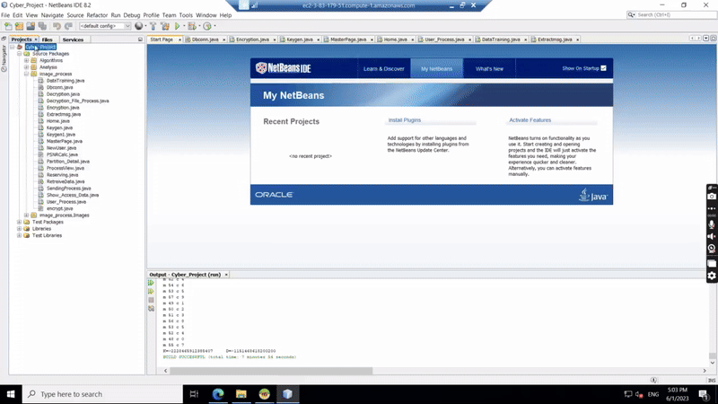

# **Encryption of Cloud Data Using Hybrid Cryptography and Steganography**  

## **Project Overview**  
This project focuses on enhancing cloud data security using a hybrid approach that combines AES and ECC encryption techniques along with LSB steganography for data concealment. The system ensures secure data transmission and storage by encrypting sensitive information, compressing it with LZW, and embedding it within an image. Additionally, SHA-256 hashing is used for data integrity verification. This project is implemented using Java, JSP, and MySQL to provide a secure and efficient cloud data protection framework.  

## **Features**  
- **Hybrid Cryptography:** AES for symmetric encryption and ECC for key generation.  
- **Steganography:** LSB technique to conceal encrypted data within images.  
- **Data Integrity:** SHA-256 hashing ensures data authenticity.  
- **Compression:** LZW algorithm reduces file size before embedding.  
- **Secure Cloud Storage:** Protects data from unauthorized access.  

## **Technologies Used**  
- **Programming Language:** Python
- **Database:** MySQL  
- **Frameworks & Libraries:** Django for GUI  

## **System Workflow**  
1. **User uploads a file** → Encrypted using **AES & ECC**.  
2. **Compression** → LZW reduces the encrypted file size.  
3. **Steganography** → The compressed encrypted file is embedded in an image using LSB.  
4. **Hashing** → SHA-256 generates a hash for integrity verification.  
5. **Cloud Storage** → The final stego image is stored securely.  
6. **Decryption & Extraction** → Reverse process to retrieve the original data.  

## **Installation & Setup**  

``` 
 1. git clone https://github.com/Enhanced-Encryption-of-Cloud-Data-using-Hybrid-Cryptography-and-Steganography

 2. Change settings.py MYSQL CONFIGURATIONS (name, user, password)

 3. cd django-crud-ajax-login-register-fileupload

 4. pip3 install -r requirements.txt

 5. python3 manage.py migrate

 6. python3 manage.py makemigrations

 7. python3 manage.py migrate

 8. python3 manage.py runserver

 9. Login to http://127.0.0.1:8000

 10. python manage.py createsuperuser (enter username, email, password)

```


## **Future Enhancements**  
- Implement **multi-user access control**.  
- Improve **encryption efficiency** with quantum-resistant algorithms.  
- Support for **additional file formats** (audio, video, etc.).  

## **Demonstration**

 
